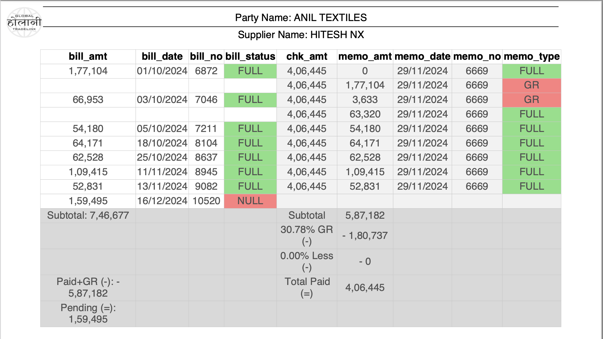
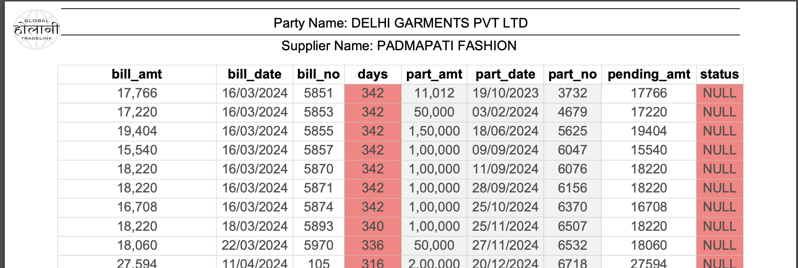

# Detailed Codebase Documentation

## Overall Project Overview
This project is a comprehensive backend system built with Python Flask and SQL. It is designed to support business operations by:
- Managing data entry for financial transactions.
- Generating detailed business reports (e.g., Khata Report, Payment List).


## Quick Navigation Guide

### Key Entry Points
- Main API: `hca_backend/app.py` - Primary HTTP endpoints
- Report Generation: `hca_backend/Reports/report_select.py` - Central report generation
- Database Operations: `hca_backend/API_Database/` - All database interactions

### Common Development Tasks
1. Adding a New API Endpoint:
   - Location: `hca_backend/app.py`
   - Required: Add route, implement request handling, add error handling
   - Example Pattern:
   ```python
   @app.route(BASE + '/endpoint', methods=['POST'])
   def new_endpoint():
       try:
           data = request.get_json()
           # Process data
           return jsonify(result)
       except Exception as e:
           return handle_data_error(e)
   ```

2. Modifying Database Operations:
   - Location: `hca_backend/API_Database/`
   - Key Files:
     - Insert operations: `insert_*.py` files
     - Update operations: `update_*.py` files
     - Retrieve operations: `retrieve_*.py` files
         - Used heavily in report generation
         - functions with ```def *_bulk_*``` are optimized for efficiency functions

3. Adding/Modifying Reports:
   - Location: `hca_backend/Reports/`
   - Base Classes: `table.py` (HeaderTable, HeaderSubheaderTable)
   - Implementation Examples: `khata_report.py`, `payment_list.py`

## Code Structure and Module Breakdown

### API Endpoints
Location: `hca_backend/app.py`
- Handle HTTP requests
- Validate input
- Interface with database via entity modules
- Key endpoints:
  - `/create_token` - Authentication
  - `/add_entry` - Create new entries
  - `/create_report` - Generate reports
  - `/backup_data` - Database backup

### Entities
Location: `hca_backend/Entities/`

Each entity encapsulates its data attributes and database operations:

1. **Individual Entities** (`Individual/` directory):
   - **Supplier** (`Supplier.py`):
     - Purpose: Represents vendors/providers
     - Key Methods: `get_supplier_name_by_id()`, `get_report_name()`
   - **Party** (`Party.py`):
     - Purpose: Represents customers/clients
     - Key Methods: `get_party_name_by_id()`, `get_report_name()`
   - **Bank & Transporter** (`Bank.py`, `Transporter.py`):
     - Purpose: Financial and logistic partners

2. **RegisterEntry** (`RegisterEntry.py`):
   - Purpose: Records Bills between a supplier and a party
   - Key Attributes:
     - bill_number: Unique identifier
     - amount: Transaction amount
     - status: Payment status
     - gr_amount: Goods return amount
     - deduction: Amount deductions
   - Key Methods:
     - `get_pending_amount()`
     - `update()`
     - `process_bill_image()`

3. **MemoEntry** (`MemoEntry.py`):
   - Purpose: Records payments of bills between suppliers and parties
   - Key Attributes:
     - memo_number: Unique identifier
     - amount: Adjustment amount
     - mode: Payment mode
     - selected_bills: Associated bills
   - Key Methods:
     - `full_payment()`
     - `database_partial_payment()`

4. **OrderForm** (`OrderForm.py`):
   - Purpose: Formalizes supplier-party orders
   - Key Attributes:
     - order_form_number
     - status
     - delivered

## Report System Documentation

### Common Report Structure
All reports follow a JSON format defined in `Reports/general_json.js`:
```json
{
    "title": "REPORT TITLE",
    "from": "start_date",
    "to": "end_date",
    "headings": [
        {
            "title": "Party Name: Example",
            "cumulative": 1200000,
            "subheadings": [...]
        }
    ]
}
```

### Report Types

1. **Khata Report** (`Reports/khata_report.py`)
   - Purpose: Track transactions between parties and suppliers
   - Columns:
     - bill_amt: Original bill amount
     - memo_amt: Payment/adjustment amount
     - memo_type: G (GR), D (Deduction)
   - Calculations:
     - GR%: (GR amount / Total memo amount) * 100
     - Less%: (Deduction amount / Total memo amount) * 100
     - Total Paid: memo_amt - GR - Deduction
     - Pending: bill_amt - Total Paid
   - Features:
     - Automatic GR percentage calculation
     - Deduction tracking
     - Transaction history
   
   Example Output:
   


2. **Payment List** (`Reports/payment_list.py`)
   - Purpose: Track pending payments and aging
   - Columns:
     - bill_amt: Original bill amount
     - part_amt: Partial payment amount
     - days: Payment age
   - Categories:
     - Under 60 days (Normal)
     - 60-120 days (Warning)
     - Above 120 days (Critical)
   - Features:
     - Aging categorization
     - Payment tracking
     - Status indicators
   
   Example Output:
   

3. **Supplier Register** (`Reports/supplier_register.py`)
   - Purpose: Supplier-wise transaction tracking
   - Columns:
     - pending_amt: Outstanding amount
     - total_bills: Total bill count
   - Features:
     - Supplier-wise totals
     - Transaction history
     - Payment tracking

4. **Payment List Summary** (`Reports/payment_list_summary.py`)
   - Purpose: Summarize pending payments by age categories
   - Columns:
     - Days: Payment age category
     - Total Amount: Sum of bills in category
     - Total Pending Amount: Outstanding amount
   - Categories:
     - Below 40 days
     - 40-70 days
     - Above 70 days
   - Features:
     - Age-based categorization
     - Party-wise summaries
     - Supplier-wise breakdowns

### Report Generation Process
1. Client sends request to `/create_report` with parameters:
   - report_type
   - date_range
   - supplier_ids
   - party_ids

2. Server flow:
   ```python
   # app.py
   @app.route('/create_report', methods=['POST'])
   def create_report():
       data = request.get_json()
       return report_select.make_report(data)
   ```

3. Report generation:
   - Data gathering from multiple tables
   - Calculations and aggregations
   - Formatting (Indian currency, dates)
   - Error handling

## Database Operations
Location: `hca_backend/API_Database/`

### Key Operations

1. **Retrieving Data**
   - File: `retrieve_*.py`

2. **Inserting Data**
   - File: `insert_*.py`
   - Includes validation
   - Handles relationships

3. **Updating Data**
   - File: `update_*.py`
   - Includes status tracking
   - Maintains data integrity

## Error Handling and Testing

### Error Handling
Location: `hca_backend/Exceptions/`
- Custom exceptions for business logic
- Standardized error responses
- Transaction rollback support

### Testing
Location: `hca_backend/Tests/`
- Unit tests for entities
- Integration tests for API
- Report generation tests

## Development Guidelines

### Code Organization
- Follow existing module structure
- Use appropriate entity classes
- Implement error handling
- Add comprehensive docstrings

### Best Practices
- Use context managers for cleanup
- Follow naming conventions
- Separate business logic from presentation
- Implement proper validation

### Common Issues and Solutions
1. Database Connection Issues
   - Check connection string
   - Verify credentials
   - Check server status

2. Report Generation Errors
   - Verify date formats
   - Check data consistency
   - Validate calculations

3. API Response Issues
   - Check request format
   - Verify authentication
   - Review error logs

## OCR System Documentation
Location: `hca_backend/OCR/`

### Components

1. **Invoice Parser** (`parse_register_entry_v2.py`)
   - Purpose: Extract information from invoice images using AI
   - Features:
     - Bill number processing with context awareness
     - Date standardization
     - Amount extraction
     - Supplier/Party name matching
   - Key Functions:
     ```python
     # Parse invoice image
     result = parse_register_entry(encoded_image, cache_file, queue_mode=False)
     
     # Process complex bill numbers
     processed_number = parser.process_bill_number(bill_number, supplier_name)
     ```

2. **Name Matching** (`name_matcher.py`)
   - Purpose: Match OCR-extracted names with database records
   - Features:
     - Fuzzy matching
     - LLM-based verification
     - Caching of matches
   - Key Methods:
     - `find_match()`: Find best database match for a name
     - `verify_match()`: Use LLM to verify matches
     - `get_fuzzy_matches()`: Get initial match candidates

3. **OCR Queue** (`ocr_queue.py`)
   - Purpose: Manage asynchronous OCR processing
   - Features:
     - Queue management
     - Status tracking
     - Image storage
   - Key Operations:
     - Add entries to queue
     - Process pending entries
     - Track completion status

### OCR Process Flow

1. Image Submission:
   ```python
   # API endpoint receives image
   @app.route('/parse_register_entry_route', methods=['POST'])
   def parse_register_entry_route():
       data = request.get_json()
       return parse_register_entry(data['image'], queue_mode=True)
   ```

2. Information Extraction:
   - Convert image to base64
   - Use AI to extract invoice data
   - Process bill numbers with context
   - Match supplier/party names

3. Name Matching:
   - Use fuzzy matching for initial candidates
   - Verify matches using LLM
   - Cache successful matches

4. Queue Management:
   - Store pending entries
   - Track processing status
   - Clean up processed entries

### OCR Best Practices

1. Image Quality:
   - Ensure good lighting
   - Minimize skew
   - Clear, readable text

2. Name Matching:
   - Maintain name cache
   - Review and correct matches
   - Update mapping for corrections

3. Queue Management:
   - Monitor queue size
   - Process entries promptly
   - Clean up old entries


## Additional Resources
- SQL Schema: `hca_backend/API_Database/holani_cloth_agency.sql`
- Test Data: `hca_backend/Tests/`
- Backup Scripts: `hca_backend/backup/`
